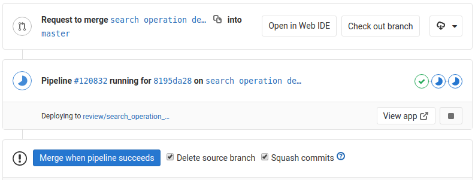
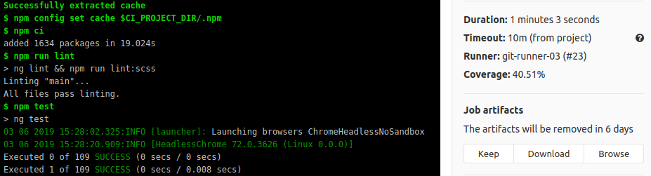
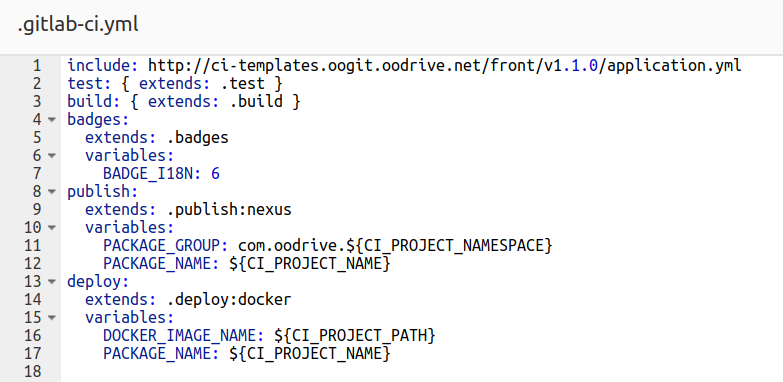

title: I ❤ Gitlab CI
author:
  name: I'm Adrien, frontend developer
  email: a.gibrat@oodrive.com
theme: ./theme
controls: false
output: index.html

--

# I <strong style="color:red">❤</strong> Gitlab CI

-- screen

## What are we talking about?

--

## Simple & Bold

Fully versioned along source <small>[in a simple .gitlab-ci.yml file](https://docs.gitlab.com/ce/ci/yaml/)</small>

Self-contained execution <small>[using Docker](https://docs.gitlab.com/ce/ci/docker/using_docker_images.html)</small>

Easy to setup & use <small>[with extensive documentation](https://docs.gitlab.com/ce/ci/introduction/)</small>

--

### Gitlab CI <small>@ Oodrive</small>

> Frontend team happily switched from Jenkins 1.x in 2016

no plugins <small>[biggest Jenkins strength & weakness](https://news.ycombinator.com/item?id=17902882)</small>

run in isolation <small>[only environment variables are injected](https://docs.gitlab.com/ce/ci/variables/)</small>

well integrated <small>[with other gitlab features](https://about.gitlab.com/features/)</small>

--

### <small>Covers</small> various use cases

> Successful for multiple pipeline types

- Single Page Applications <small class="fragment">[build](https://docs.gitlab.com/ce/ci/examples/), [release](https://docs.gitlab.com/ce/workflow/releases.html) & [deploy](https://docs.gitlab.com/ce/topics/autodevops/)</small>
- Components & libraries <small class="fragment">[test](https://about.gitlab.com/2018/02/05/test-all-the-things-gitlab-ci-docker-examples/) & [publish](https://about.gitlab.com/stages-devops-lifecycle/package/)</small>
- End2end tests <small class="fragment">[scheduled executions](https://docs.gitlab.com/ce/user/project/pipelines/schedules.html) & [aggregate data](https://about.gitlab.com/2016/08/26/ci-deployment-and-environments/)</small>
- Documentations & tasks <small class="fragment">[hosted by gitlab pages](https://docs.gitlab.com/ce/user/project/pages/)</small>

--

# What does it look like ?

Few examples how we use Gitlab CI

-- screen

### Pipelines show jobs status at each step

Visible pipeline details <small>[in Merge Request view ](https://about.gitlab.com/2016/07/29/the-basics-of-gitlab-ci/)</small>

-- screen full

### Jobs log task execution & keep artifacts

Easy to read logs <small>[ansi colors support](https://gitlab.com/gitlab-org/gitlab-ce/issues/37898)</small>

Save artifacts between jobs <small>[to access it later](https://docs.gitlab.com/ce/user/project/pipelines/job_artifacts.html)</small>

-- screen large

### Using template allow DRY CI settings

Reusable versioned templates <small>[with include & extends](https://docs.gitlab.com/ce/ci/yaml/#include)</small>

--

## Last tips

- [Package tools](https://docs.gitlab.com/ce/ci/docker/using_docker_build.html) with [Docker](https://github.com/wsargent/docker-cheat-sheet)
- Script with your [favorite language](https://nodejs.org/en/docs/es6/), glue with [Bash](https://devhints.io/bash)
- [Maven project](https://www.unix-experience.fr/gitlab/gitlab_ci_maven_pipeline/) can enjoy Gitlab CI too 
- Use core features today, [check new features](https://about.gitlab.com/direction/#cicd "not free yet?") often
